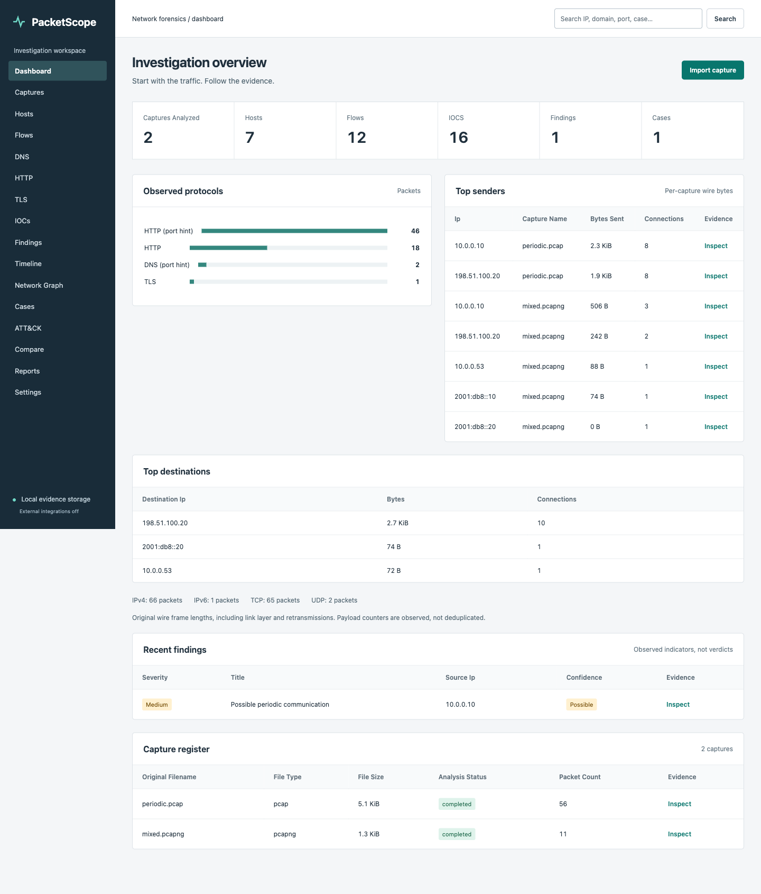
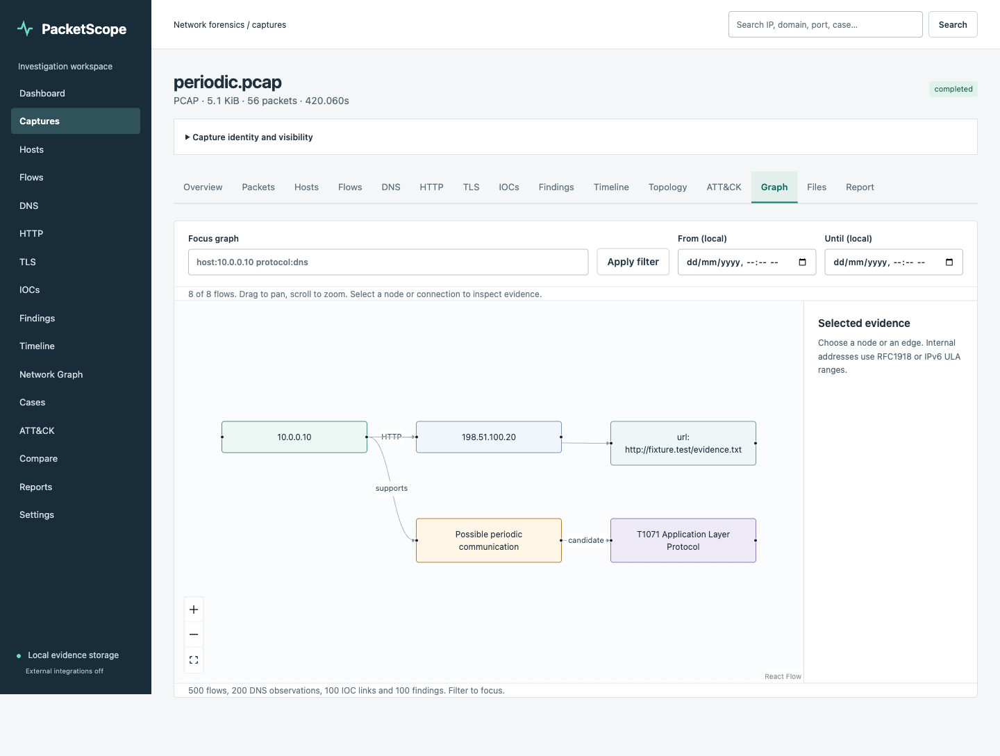
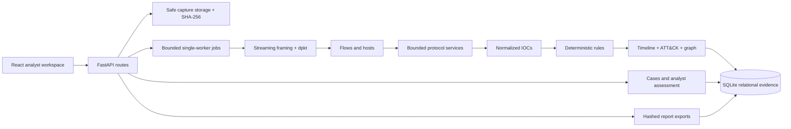

# PacketScope

**Network Forensics & Traffic Investigation Platform**

A local-first platform that analyzes PCAP/PCAPNG captures, reconstructs network
flows and observable sessions, extracts indicators, identifies suspicious traffic
patterns, maps supported evidence to MITRE ATT&CK candidates, reconstructs
timelines, and generates evidence-backed forensic reports.

This is an investigation layer, not a Wireshark replacement, active scanner or
automatic compromise classifier. **Captured traffic is evidence, never executable
input.** No cloud, account, paid API or LLM is needed for core functionality.

## Screenshots

Actual application screenshots using the project's **synthetic benign fixtures**.
No example activity is seeded into a fresh installation.





[Findings](docs/screenshots/findings.png) ·
[Analyst case](docs/screenshots/analyst-case.png) ·
[Mobile workspace](docs/screenshots/mobile-workspace.png)

## Installation and local use

Requires **Python 3.12+** and **Node 20.19+**. The following commands are for a
POSIX shell, starting in the repository root. Dependency installation needs
package registry access; analysis works offline afterward.

```sh
python3.12 -m venv .venv
.venv/bin/python -m pip install -r backend/requirements/lock.txt
cd frontend
npm ci
npm run build
cd ../backend
../.venv/bin/uvicorn app.main:app --host 127.0.0.1 --port 8765 --limit-concurrency 16
```

Open **http://127.0.0.1:8765/**. The backend serves the production React build.
Interactive API documentation is at **http://127.0.0.1:8765/docs**.

Alembic upgrades the SQLite schema at startup. Data defaults to `backend/data`
when launched as above. `PACKETSCOPE_DATA=/absolute/local/path` selects a different
local evidence directory. Stop the server before copying that directory as a
backup so SQLite/WAL and evidence files are consistent. Run one server worker.

### Development

Use the backend command above. In a second terminal, starting at the repository root:

```sh
cd frontend
npm run dev
```

Open **http://127.0.0.1:5179/**. Vite proxies `/api` to loopback port 8765.
The frontend is React + strict TypeScript + Vite + Tailwind; no remote fonts,
analytics, CDN assets or authentication services are required.

## Example investigation

```sh
.venv/bin/python fixtures/generate.py --output artifacts/fixtures
```

1. Import `artifacts/fixtures/mixed.pcapng`, then choose **Analyze capture**.
2. Check capture SHA-256, frame count, progress and visibility notices.
3. Inspect hosts, bidirectional flows, DNS answers, HTTP requests and TLS SNI.
4. Import `periodic.pcap`. Its eight distinct, closed HTTP conversations produce
   a possible-periodicity finding, not a definitive C2 verdict.
5. Follow **Finding → evidence → frame/flow**. Inspect the timeline and graph.
6. Create a case, attach the capture/finding, add notes and record an assessment.
7. In **Files**, explicitly acknowledge untrusted content before extracting a
   complete HTTP body. Nothing is executed.
8. Generate PDF, Markdown, JSON or STIX from **Report**, optionally including the
   linked case assessment.

Filters include `host:10.0.0.10`, `destination:198.51.100.20`, `port:443`,
`protocol:dns`, `flow_id:<uuid>` and `severity:Medium` where applicable.
Global search finds IPs, domains, URLs, MACs, ports, protocols, captures, cases
and findings. Unsupported filter syntax returns a useful error.

## Features

| Area | Implemented behavior |
|---|---|
| Evidence intake | Content-based PCAP/PCAPNG validation, streamed SHA-256, random owner-only storage, capture register and protected deletion |
| Packet and flow engine | Bounded framing, frame offsets, structured decoded details/optional hex, IPv4/IPv6, timing, bidirectional wire bytes, TCP observed state and tuple reuse |
| Protocol investigation | Correlated DNS; bounded HTTP/1 reassembly; TLS hello/SNI/JA3 and observable certificates; ARP/DHCP/ICMP and limited SMB headers |
| IOC explorer | Normalization, per-capture deduplication, relational evidence and host/flow associations, TXT/CSV/JSON/STIX |
| Detection | Nine configurable deterministic rules with real statistics, severity, confidence, configuration snapshots and evidence |
| Investigation | Filterable timeline, interactive topology/relationship graph, capture comparison, cases, evidence links, notes and analyst assessment |
| ATT&CK | Supported T1046 and conditional weak T1071 candidate mappings; no mapping without finding evidence |
| Advanced | Explicit complete HTTP body extraction; optional RDAP/DNS/VirusTotal adapters; versioned ReverseScope hash-only handoff |
| Reports | Real PDF, Markdown, streaming JSON and STIX; persisted immutable hashed outputs with case assessment |

Ethernet/VLAN, raw IP, loopback and Linux cooked v1/v2 links are supported.
FTP, SSH, SMTP, IMAP, POP3 and NTP can be identified by known ports (SSH also by
banner); **port hints are labelled**, not represented as full dissectors.

## Architecture



The database has **26 tables**, not one capture-sized JSON document. Protocol
services, reconstruction, rules, graph queries, integrations and reports are
separate from API routes. See [architecture and schema](docs/architecture.md)
and the [phase-by-phase delivery record](docs/delivery.md).

## Detection methodology

Rules operate on actual normalized observations. Port/host scans use sliding
windows of distinct destinations, periodicity uses distinct bidirectional
conversations and measured interval variation, and transfer findings disclose
their wire-byte basis. DNS, HTTP, TLS and ARP conditions expose their evidence.

**Severity is not confidence.** Repeated SYN retransmissions are not new beacon
connections. TLS expiry is evaluated at capture time, not today's date. STIX
exports observed cyber-observables/ObservedData, not invented malicious
Indicators. Details: [detection engine](docs/detection-engine.md).

## Security and practical limits

Bind only to loopback. This is a **single-analyst local tool**, not an
authenticated multiuser service. Never expose its API or development server
to an untrusted network.

Requests are bounded before multipart parsing, uploads are serialized, captures
are stored outside the web root, names are sanitized, original hashes are checked
before evidence extraction/reporting, and downloaded payloads use attachment-only
octet-stream handling. No network payload is executed, decompressed or sent to a
provider automatically. External intelligence is off by default.

Default ceilings: 128 MiB/capture, 250,000 packets/capture, 30,000 flows, 20,000
hosts, 256 KiB/2048 TCP segments per direction, 200,000 derived records/capture,
600 seconds/job, four queued/running jobs, 200 captures, 2 GiB capture-file quota
and one million indexed packets per workspace. JSON/PDF/Markdown/STIX reports cap
at 64 MiB; STIX additionally caps at 10,000 IOCs. Limits fail explicitly.

Measured locally: **100,000 synthetic packets (8.49 MiB) in 12.821 seconds**, peak
whole-process RSS **157.9 MiB**; 512 flows, 65 hosts, 67 observed IOCs and zero
findings. This is a documented workload, **not** a multi-gigabyte performance
claim. Protocol-heavy captures can be slower. [Performance details](docs/testing.md).

## Tests

Run from the repository root:

```sh
cd backend
../.venv/bin/pytest --cov=app --cov-report=term-missing
../.venv/bin/ruff check app tests migrations benchmark.py
../.venv/bin/pip-audit --progress-spinner=off
cd ../frontend
npm run typecheck
npm run build
npm audit --audit-level=moderate
PLAYWRIGHT_BROWSERS_PATH=../artifacts/pw-browsers npx playwright install chromium
npm run test:e2e
```

The browser suite starts/stops its own isolated localhost server on port 8766 and
uses `artifacts/e2e-data`, never your ordinary evidence directory. Generated
captures, browser binaries, traces and databases stay under ignored `artifacts/`.

The final verification includes **99 backend tests** (10 use independent,
externally supplied synthetic acceptance captures), **2 Playwright workflows**,
strict TypeScript/build, dependency audits and desktop/mobile axe checks.
Without the optional independent fixture directory, 89 tests pass and 10 are
explicitly skipped. [Exact commands, coverage and acceptance](docs/testing.md).

## Limitations and roadmap

* No arbitrary TLS/HTTPS decryption, TLS 1.3 encrypted certificate recovery,
  HTTP/2 or QUIC decoding, or JA4 calculation.
* TCP reconstruction is bounded; gaps, conflicting retransmissions, missing SYNs
  and resource truncation are explicit. IP fragment reassembly is not implemented.
* SMB support is header metadata, not proof of authentication, lateral movement
  or file access. Several additional protocols are port hints only.
* Flow byte counters are wire bytes including retransmissions, not unique
  application payload. Host attribution is constrained by NAT and sensor placement.
* Packet loss and capture truncation limit conclusions. Rules can produce false
  positives or miss sophisticated activity. Fingerprints are not identities.
* Graph/list/report views disclose their limits. PDF/Markdown show up to 250 rows
  per section; JSON streams the full normalized record set within its export cap.
* RDAP uses ARIN and does not follow referrals. External adapters were verified
  with mock transports only; no test indicators were shared with live providers.
* ReverseScope is an explicit hash-envelope contract, not an assumed live API.

Future work: isolated process workers, deeper HTTP/2/QUIC/SMB dissectors, reviewed
IP fragment support, larger disk-backed reconstruction, streaming STIX at higher
cardinality, richer DNS baselines, analyst-configurable internal address ranges,
and an agreed ReverseScope consumer API. See [security](docs/security.md).
