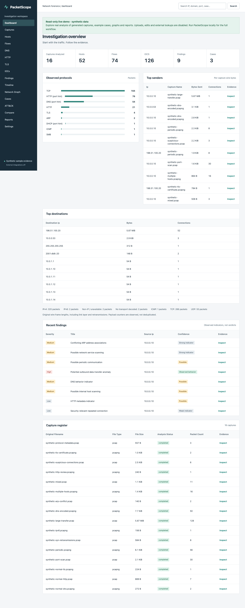

# Live preview: Vercel frontend + Render backend

The repository includes a **read-only, preloaded synthetic demo**, not a public
instance of the unrestricted local analyst tool. All displayed findings come
from actual analysis of generated capture bytes.

```text
Visitor -> https://YOUR-PROJECT.vercel.app
             /api/* rewrite -> https://YOUR-SERVICE.onrender.com/api/*
                                  FastAPI + seeded SQLite + sample reports
```

Vercel hosts the built React frontend. Render runs the Python backend and stores
its generated evidence. All API calls and download links remain same-origin
from the browser's perspective through the Vercel rewrite, so no permissive CORS
or client-side API key is needed.



## Included sample data

Render initializes the dataset automatically before the health check becomes
ready. You do **not** need to upload captures, copy a database, generate reports
manually or connect a cloud database.

* **16 analyzed captures / 324 packets**, across PCAP and PCAPNG: baseline DNS,
  HTTP, TLS, IPv6, mixed traffic, periodic communication, retransmission negative
  control, port/host scanning patterns, encoded-looking DNS, large transfer, ARP
  conflict, suspicious connection context, HTTP metadata, visible X.509 certificate
  and DHCP/ICMP/SMB protocol metadata.
* **9 evidence-based findings**, covering all nine rule types.
* **3 example cases**, with linked captures/hosts/IOCs/findings, notes and explicit
  illustrative analyst assessments.
* **64 downloadable reports**: PDF, Markdown, JSON and STIX for every capture.
* **3 extracted benign text bodies**, including their hashes and ReverseScope
  hash-only handoff envelopes.
* Populated dashboard, search, timelines, topology/investigation graphs and
  supported ATT&CK candidates. Optional threat intelligence remains unavailable,
  not filled with fake reputation data.

Every page labels the dataset synthetic and read-only. Uploads, reanalysis,
deletion, case edits, new extraction/report generation and external lookups are
blocked server-side with HTTP 403. Existing reports/IOC exports, safe evidence
downloads, filters, search and capture comparison remain usable.

## 1. Put this branch in your GitHub repository

The current checkout has no remote configured. Create/select your own GitHub
repository, publish the code there, and choose the branch containing these files
when configuring both providers. Do not upload `artifacts/`, personal captures,
`.venv/`, `.env` files or local databases. The ignore files exclude them.

This setup does not publish a repository or provision a paid service automatically.

## 2. Deploy the backend on Render

**Blueprint path (recommended):**

1. Open the [Render dashboard](https://dashboard.render.com/) and choose
   **New → Blueprint**.
2. Connect the repository and select the branch containing this implementation.
3. Use the root `render.yaml`. Review the proposed `packetscope-demo` web service
   and its **Free** compute plan before confirming.
4. Wait until the service is live. Copy its actual URL, for example
   `https://packetscope-demo-abcd.onrender.com`.
5. Open `https://YOUR-SERVICE.onrender.com/api/health`. It must return:

```json
{"status":"ok","mode":"demo","version":"1.0.0"}
```

**Manual Render configuration (same result):**

| Setting | Value |
|---|---|
| Service type | Web Service |
| Repository root directory | Leave empty (repository root) |
| Runtime / Language | Docker |
| Dockerfile path | `./Dockerfile` |
| Docker build context | `.` |
| Docker command | Leave empty; use the image default |
| Health check path | `/api/health` |
| Instances | One |
| `PACKETSCOPE_DEMO` | `true` |
| `PACKETSCOPE_EXTERNAL_ENABLED` | `false` |
| `PACKETSCOPE_DATA` | `/app/demo-data` |
| `PACKETSCOPE_BIND` | `0.0.0.0` |

The launcher honors Render's `PORT` environment variable. Render's own
`RENDER_EXTERNAL_HOSTNAME` is automatically added to the API Host allowlist.
For a custom backend domain, add it explicitly via
`PACKETSCOPE_ALLOWED_HOSTS=localhost,127.0.0.1,your-api-domain.example`.
Do not configure wildcard Hosts, external intelligence keys, multiple workers,
or a directory containing private investigations.

The Docker image runs as non-root. Its build context is allowlisted to source,
fixtures and dependency manifests, so local evidence databases and artifacts
are not sent to the image builder.

## 3. Connect Vercel to the actual Render URL

From the repository root, replace the deliberately nonfunctional placeholder:

```sh
cd frontend
npm run configure:render -- https://YOUR-SERVICE.onrender.com
```

This updates `frontend/vercel.json` to contain:

```json
{
  "source": "/api/:path*",
  "destination": "https://YOUR-SERVICE.onrender.com/api/:path*"
}
```

Commit and push the updated `frontend/vercel.json` to your repository before
deploying Vercel. The helper accepts an HTTPS `onrender.com` origin, not an API
path. If you use a custom backend domain, edit the destination manually and set
the Render Host allowlist as described above.

No `VITE_API_URL` or other frontend environment variable is required. Do not
point the browser directly at Render or add `/api` twice.

## 4. Deploy the frontend on Vercel

In [Vercel](https://vercel.com/new), import the same repository and branch:

| Setting | Value |
|---|---|
| Framework preset | Vite |
| Root Directory | `frontend` |
| Install Command | `npm ci` |
| Build Command | `npm run build` |
| Output Directory | `dist` |
| Node.js version | `22.x` |
| Environment variables | None needed |

Vercel reads `frontend/vercel.json` because `frontend` is its project root. That
file includes the external API rewrite and browser security headers. Navigation
uses hash routes, so a catch-all HTML rewrite is unnecessary and should not
replace the `/api` rule.

After deployment, open the Vercel URL. Verify:

1. `/api/health` returns JSON with `"mode":"demo"`, not HTML.
2. `/api/settings` returns `"demo_mode":true`, `"read_only":true`.
3. The dashboard shows 16 captures, 9 findings and 3 cases.
4. A capture's Graph and Report tabs work, and existing PDF/JSON downloads open.
5. `POST /api/cases` returns 403. Upload/edit controls are absent.

**Use the Vercel URL as the portfolio/live-preview link.** The Render URL is the
backend, though it also serves the built frontend as a convenient fallback.

## Restarts, free tier and sample persistence

Render Free services can sleep when idle and lose local filesystem changes on
restart/redeploy. This demo intentionally requires **no persistent disk**:
startup regenerates its synthetic database, analyzed captures, cases and reports.
If the existing verified demo directory is still present, startup reuses it
without duplicates. Capture/case IDs can change after a full rebuild, so share
the workspace URL rather than a permanent deep link to one sample record.

The first request after an idle period can take roughly a minute while Render
wakes, plus dataset initialization time. If Vercel shows an API-loading error,
wait for Render `/api/health` to become ready and reload. Choose an appropriate
paid, always-on Render compute plan for a smoother recruiter-facing preview;
review current provider pricing before upgrading.

Never use this public demo configuration to collect real investigation data.
It intentionally cannot save visitor changes. A writable shared deployment
would need authentication, authorization, durable storage, quotas and isolated
analysis workers; the unrestricted local mode is not that deployment.

## Local preview of the same seeded application

After installing the README dependencies and building the frontend:

```sh
cd backend
PACKETSCOPE_DATA=../artifacts/live-demo ../.venv/bin/python demo.py
```

Open `http://127.0.0.1:8765/`. The launcher always enables demo mode, defaulting to
loopback. It will not mix a pre-existing ordinary database into the sample
dataset. If a demo setup was interrupted, choose a **new empty directory**;
do not delete or repurpose a directory containing real evidence.

Or use the exact Render image locally:

```sh
docker build -t packetscope-demo .
docker run --rm --name packetscope-demo \
  -p 127.0.0.1:8765:10000 --memory=512m --cpus=1 \
  --cap-drop=ALL --security-opt=no-new-privileges \
  packetscope-demo
```

No data volume is necessary. Stop it with `docker stop packetscope-demo`.
Do not mount your normal evidence directory into the demo container.

## Deployment references

* [Render Docker services](https://render.com/docs/docker)
* [Render Blueprint specification](https://render.com/docs/blueprint-spec)
* [Render Free service limitations](https://render.com/docs/free)
* [Vercel external rewrites](https://vercel.com/docs/rewrites)
